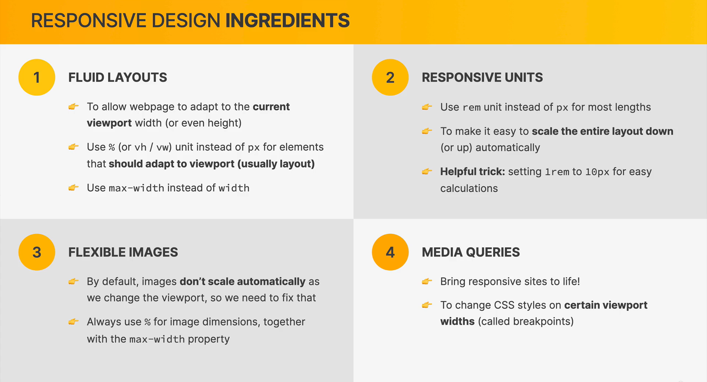
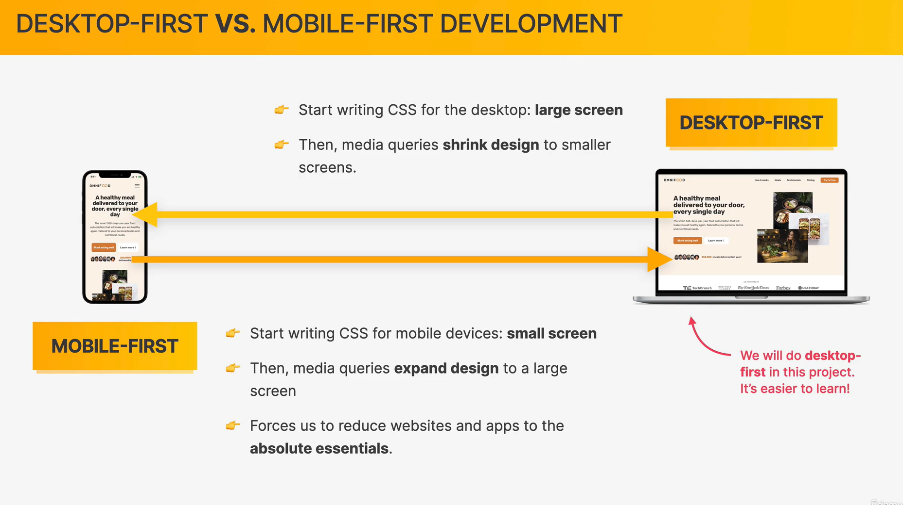

# Responsive design





## 使用max-width

解释：
> 如果父容器的宽度大于我们给子容器定义的max-width，那么子容器的宽度是就是max-width。<br/>
> 如果父容器的宽度小于子容器定义的max-width，那么子容器的宽度是父容器的100%。

## rem 和 百分比%

**rem:**

rem就是以根元素（html）的字体大小为单位。

比如html的`font-size: 16px`，那么`1rem`等于`16px`。

**百分比% ：**

我以前是这样写的：
```css
html {
  font-size: 10px;
}
```
然后别的元素大小：
```css
div {
  width: 20rem;
}
```

但是直接把html的font-size写死不是一个好的办法，如果用户修改浏览器设置，那么我们的网站还是以16px为单位，不太好。

这时候html的font-size我们应该使用百分比`%`：

```css
html {
  /*
  我想以10px为1rem这样设置
  所以：10px / 16px(浏览器默认) =  0.625 = 62.5%
   */
  font-size: 62.5%;
}
```
这时，如果用户修改了浏览器的字体大小设置，那么我们的网站的字体也是跟随变化。


